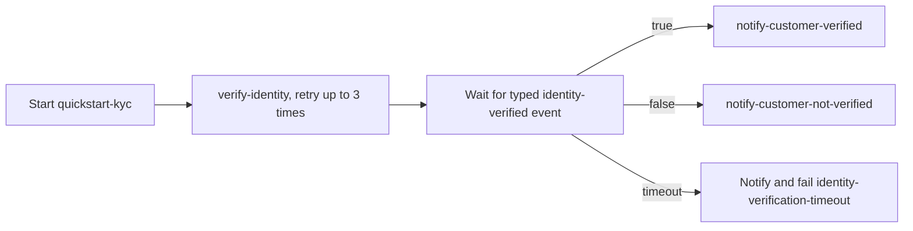

# 00 Quickstart: KYC Workflow

This example is a deterministic adaptation of the upstream KYC quickstart. You will learn how to:

- Register task definitions, a typed correlated external event, and a `WfSpec`.
- Use required, searchable, and masked workflow variables.
- Retry a technical task failure with `.withRetries(3)`.
- Wait for a typed boolean event correlated by email.
- Handle an event timeout and use `WorkerContext` inside a task worker.
- Start a `WfRun` from Java and inspect it with `lhctl`.

## Workflow



`full-name` and `email` are required and searchable. `ssn` is required and masked. The event content is a boolean, and its correlation key is the email string.

## Prerequisites

- Java 21 or newer.
- `lhctl` installed and configured.
- `lh-standalone:1.2.1` running, or another compatible LittleHorse Server. See the shared [server prerequisites](../../README.md).
- Verify connectivity with `lhctl whoami`.

The application creates `LHConfig` with `new LHConfig()`, so `LHC_*` environment variables select a remote server when needed.

## Run

From the `lh-developer-hub` repository root, run this exact command:

```bash
./gradlew -p examples/lh-server/java/00-quickstart run
```

The process stays alive because its task workers are running. It registers metadata, starts the workers, and prints a programmatically-created sample run ID:

```text
Started sample WfRun: <wfRunId>
Send identity-verified for ada@example.com to complete the sample run.
```

## Drive The Workflow

The application already starts one sample run. To start another run with `lhctl`:

```bash
lhctl run quickstart-kyc full-name 'Grace Hopper' email grace@example.com ssn 987654321
```

The run is `RUNNING` while it waits for the correlated event. Complete it with `true`:

```bash
lhctl put correlatedEvent grace@example.com identity-verified BOOL true
```

Use `BOOL false` to execute the not-verified branch. To exercise the timeout branch, start a run and do not send its event; the timeout is five minutes.

Expected task output includes:

```text
Verification request accepted for Grace Hopper at grace@example.com (SSN ending 4321)
Notified Grace Hopper that identity was verified
```

The terminal state for the true and false paths is `COMPLETED`. The timeout path is `ERROR` after the notification and the `identity-verification-timeout` failure.

The identity task's retry policy is for technical failures and timeouts. A named `LHTaskException` represents a business exception and is not retried by this policy.

## Inspect A Run

```bash
lhctl get wfRun <wfRunId>
lhctl list nodeRun <wfRunId>
lhctl get taskRun <wfRunId> <taskRunGlobalId>
lhctl search variable --name email --value grace@example.com --varType STR --wfSpecName quickstart-kyc --wfSpecMajorVersion 0 --wfSpecRevision 0
```

The `WfRun` output shows the final `identity-verified` value and the event wait. `list nodeRun` shows the verification, event, and notification nodes. `get taskRun` shows task attempts, including retries if a worker-side technical error is introduced while experimenting with `QuickstartTasks`.

## WfSpec And WfRun

`QuickstartWorkflow` runs once at startup to author and register a graph. It does not execute Java business logic. Later, the server creates a `WfRun`; task workers execute `QuickstartTasks` only when that run reaches a task node. The shutdown hook closes every `LHTaskWorker`.

## Source Files

- [`QuickstartWorkflow.java`](./src/main/java/io/littlehorse/examples/QuickstartWorkflow.java) defines the graph, event wait, retry, retention, and timeout handler.
- [`QuickstartTasks.java`](./src/main/java/io/littlehorse/examples/QuickstartTasks.java) contains runtime task methods.
- [`QuickstartApplication.java`](./src/main/java/io/littlehorse/examples/QuickstartApplication.java) registers metadata, starts workers, and creates the sample run.

## Common Failure Modes

- `lhctl whoami` fails: the standalone server is not running, or the `LHC_*` endpoint/auth environment is not configured.
- A run remains at a task node: the matching worker process is not running or its task definition was not registered.
- A run remains at the event node: send a correlated event with the exact email key and event name.
- Registration reports an existing incompatible event or spec: remove the old development metadata or use a new name/version before retrying.
