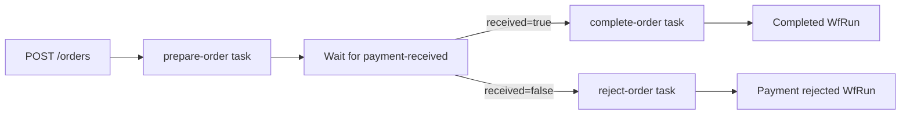

# Start LittleHorse Workflows from Spring Boot

This example wraps an event-driven LittleHorse workflow in a conventional Spring Boot REST API. One process registers the workflow metadata, runs its task workers, and serves HTTP requests.

You will learn how to:

- Start a `WfRun` from a Spring controller.
- Send an `ExternalEvent` to a waiting workflow.
- Fetch a `WfRun` and all of its variables.
- Return application-specific DTOs instead of exposing protobuf messages over HTTP.
- Start the same workflow with `lhctl` for debugging.

## Workflow



The entrypoint variables are:

| Variable | Purpose |
| --- | --- |
| `user-id` | The customer placing the order. |
| `item-id` | The item being ordered. |
| `order-status` | `AWAITING_PAYMENT`, `COMPLETED`, or `PAYMENT_REJECTED`. |

After the payment event arrives, a workflow conditional routes accepted payments to `complete-order` and rejected payments to `reject-order`.

## Prerequisites

- Java 21+
- A running LittleHorse Server as described in [`../../README.md`](../../README.md)

## Run the Application

From the repository root:

```bash
./gradlew :examples:lh-server:java:05-spring-boot:bootRun
```

The application listens on `http://localhost:8081`. Port `8080` remains available for the dashboard included in `lh-standalone`. On startup the application registers the task definitions, `payment-received` event definition, and `spring-boot-order` workflow, then starts both task workers.

## Start an Order with REST

```bash
curl -sS -X POST http://localhost:8081/orders \
  -H 'Content-Type: application/json' \
  -d '{"userId":"user-123","itemId":"item-456"}'
```

The response contains the LittleHorse workflow-run ID:

```json
{"wfRunId":"..."}
```

Use that ID in the following requests. Before payment arrives, the workflow has status `RUNNING` and `order-status` is `AWAITING_PAYMENT`:

```bash
curl -sS http://localhost:8081/orders/<wfRunId>
```

```json
{
  "id": "...",
  "status": "RUNNING",
  "variables": {
    "user-id": "user-123",
    "item-id": "item-456",
    "order-status": "AWAITING_PAYMENT"
  }
}
```

Send the payment event. The idempotency key prevents a retried HTTP request from creating a second event:

```bash
curl -sS -X POST http://localhost:8081/orders/<wfRunId>/payment \
  -H 'Content-Type: application/json' \
  -d '{"received":true,"idempotencyKey":"payment-123"}'
```

Fetch the order again. Its status and `order-status` will now be `COMPLETED`.

## Start the Same Workflow with lhctl

Keeping the Spring Boot application running ensures its workers remain available:

```bash
lhctl run spring-boot-order \
  user-id manual-user \
  item-id manual-item
```

Inspect the returned run ID with either `lhctl get wfrun <wfRunId>` or `GET /orders/<wfRunId>`. You can still send its payment through the REST endpoint.

## Important Source Files

- [`OrderWorkflow.java`](./src/main/java/io/littlehorse/examples/OrderWorkflow.java) defines the workflow graph.
- [`OrderTasks.java`](./src/main/java/io/littlehorse/examples/OrderTasks.java) contains runtime business logic executed by workers.
- [`OrderRuntime.java`](./src/main/java/io/littlehorse/examples/OrderRuntime.java) registers metadata and manages workers.
- [`OrderController.java`](./src/main/java/io/littlehorse/examples/OrderController.java) translates HTTP requests into LittleHorse RPCs.

Workflow-authoring code runs when the application registers the `WfSpec`; task methods run later when a `WfRun` reaches their nodes.

## Remote LittleHorse Servers

The application uses `new LHConfig()`, which reads `LHC_*` environment variables. Source the environment configuration for your remote server before starting Gradle; no source changes are needed.
