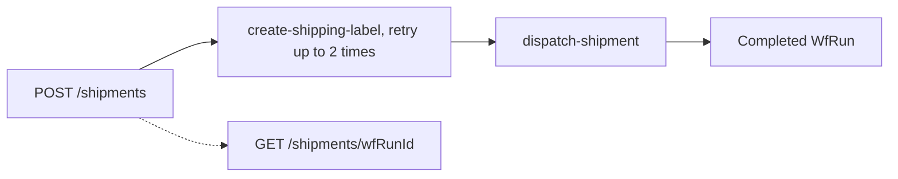

# 10 Javalin: Shipment REST API

This example shows a lightweight REST integration without Spring Boot. You will learn how to:

- Create an `LHConfig`, blocking client, and task workers in application code.
- Register a shipment `WfSpec` before serving requests.
- Start a `WfRun` from a Javalin endpoint.
- Return a semantic response assembled from the `WfRun` and its variables.
- Use a Javalin server-stopping hook to close all task workers that use the LittleHorse client.
- Apply a task-specific retry policy for shipping-label creation.

## Workflow



The workflow is intentionally a shipment domain rather than another payment-event example. Its semantic `shipment-status` changes from `LABEL_CREATED` to `DISPATCHED`.

## Prerequisites

- Java 21 or newer.
- `lhctl` installed and configured.
- `lh-standalone:1.2.1` running, or another compatible LittleHorse Server. See the shared [server prerequisites](../../README.md).
- Verify connectivity with `lhctl whoami`.

The application uses `new LHConfig()`, which reads `LHC_*` environment variables. It uses port `8082`, leaving port `8080` for the standalone dashboard.

## Run The Application

From the `lh-developer-hub` repository root, run this exact command:

```bash
./gradlew -p examples/lh-server/java/10-javalin run
```

Startup registers both task definitions and `javalin-shipment`, starts both workers, and then starts Javalin:

```text
Javalin shipment API listening on http://localhost:8082
```

## Start And Inspect A Shipment

Start a run through REST:

```bash
curl -sS -X POST http://localhost:8082/shipments \
  -H 'Content-Type: application/json' \
  -d '{"shipmentId":"ship-123","destination":"Mars"}'
```

Expected response:

```json
{"wfRunId":"..."}
```

The worker terminal prints:

```text
Created label for ship-123 to Mars
Dispatching ship-123 after LABEL_CREATED
```

Fetch the semantic response using the returned ID:

```bash
curl -sS http://localhost:8082/shipments/<wfRunId>
```

Expected terminal response:

```json
{"id":"...","status":"COMPLETED","variables":{"shipment-id":"ship-123","destination":"Mars","shipment-status":"DISPATCHED"}}
```

The same workflow can be started without the REST layer:

```bash
lhctl run javalin-shipment shipment-id ship-456 destination Venus
```

## Inspect With lhctl

```bash
lhctl get wfRun <wfRunId>
lhctl list nodeRun <wfRunId>
lhctl get taskRun <wfRunId> <taskRunGlobalId>
```

The `WfRun` and REST response expose semantic status and variables. `get taskRun` contains execution and attempt details for retry behavior.

The label task's retry policy is for technical task failures and timeouts. A named `LHTaskException` represents a business exception and is not retried by this policy.

## WfSpec, WfRun, And Lifecycle

`ShipmentWorkflow.build()` authors a graph once during startup. It does not execute `createLabel()` or `dispatchShipment()`. The server creates a `WfRun` for each REST or `lhctl` request, and workers execute task methods as that run advances. Javalin's `serverStopping` callback closes both `LHTaskWorker` instances; the shared `LHConfig` remains owned by the worker/client process for its lifetime.

## Source Files

- [`ShipmentWorkflow.java`](./src/main/java/io/littlehorse/examples/ShipmentWorkflow.java) defines the graph and retention/retry policy.
- [`ShipmentTasks.java`](./src/main/java/io/littlehorse/examples/ShipmentTasks.java) contains runtime shipment operations.
- [`ShipmentRuntime.java`](./src/main/java/io/littlehorse/examples/ShipmentRuntime.java) owns metadata registration and resource shutdown.
- [`JavalinApplication.java`](./src/main/java/io/littlehorse/examples/JavalinApplication.java) defines the REST endpoints and semantic response.

## Common Failure Modes

- `lhctl whoami` fails: the standalone server is not running, or `LHC_*` is not configured.
- POST returns a connection error: the Javalin process is not running on port `8082`.
- A run remains at a task node: the matching worker is stopped or its task definition was not registered.
- GET returns 404: the ID is not a LittleHorse `WfRun` ID, or the run belongs to a different server environment.
- An old incompatible `javalin-shipment` spec exists: use a clean development server or register a new workflow name/version.
