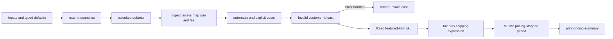

# 15 Advanced Variables: Deterministic Pricing

This example builds a deterministic pricing workflow without JSON workflow variables. You will learn how to:

- Declare required, defaulted, searchable, and masked primitive variables.
- Pass typed `Array<INT>`, `Array<DOUBLE>`, and `Map<STR, DOUBLE>` values to workers.
- Append task output with `extend`, read a map entry with `get`, and count an array with `size`.
- Build arithmetic expressions and assign their results to variables.
- Use automatic `INT` to `DOUBLE` conversion and explicit casts.
- Handle a deliberately invalid `STR` to `INT` cast with `handleError()`.
- Preview typed struct field access with `.get()` while leaving struct construction to the later structs example.
- Mutate a workflow variable with `VariableMutationType.ASSIGN`.

## Workflow



`customer-id` and `secret-note` are required. `customer-id` is searchable; `secret-note` is masked. `quantities`, `unit-prices`, and `fees` have typed defaults that can be overridden at run time. `featured-item` is a registered typed struct input, and only its `sku` field is read here.

## Prerequisites

- Java 21 or newer.
- `lhctl` installed and configured.
- `lh-standalone:1.2.1` running, or another compatible LittleHorse Server. See the shared [server prerequisites](../../README.md).
- Verify connectivity with `lhctl whoami`.

The application creates configuration with `new LHConfig()` and reads `LHC_*` environment variables for server connection settings.

## Run The Application

From the `lh-developer-hub` repository root, run this exact command:

```bash
./gradlew -p examples/lh-server/java/15-advanced-variables run
```

Expected startup output:

```text
Registered advanced-pricing and started its task workers.
```

The process stays alive so its workers can execute runs.

## Run The Pricing Workflow

The following command supplies the required values and a typed struct. The array and map arguments are typed by the registered workflow variables:

```bash
lhctl run advanced-pricing \
  customer-id customer-42 \
  secret-note 'do-not-log' \
  quantities '[2,1,3]' \
  unit-prices '[19.99,8.50,3.25,1.00]' \
  fees '{"tax-rate":0.0825,"shipping":4.50}' \
  featured-item '{"sku":"LH-BOOK","description":"Workflow book"}'
```

`load-extra-quantity` appends `[1]`, so the array size becomes `4`. With the default prices and quantities, the subtotal is `59.23`, and the total expression adds 8.25% tax and `4.50` shipping. The worker prints a line similar to:

```text
items=4, quantities=4, prices=4, shipping=4.5, fees={tax-rate=0.0825, shipping=4.5}
customer=customer-42, total=68.616475, stage=priced, units=2
```

The workflow completes after the invalid cast is handled. The invalid cast is expected: `customer-42` is explicitly cast to `INT`, fails before `parse-customer-number` can run, and routes to `record-invalid-cast`. The default `customer-tier` value of the string `2` is explicitly cast successfully to `INT`; `item-count` is passed to `automatic-double` through an automatic numeric conversion.

## Inspect Values And Task Attempts

```bash
lhctl get wfRun <wfRunId>
lhctl list nodeRun <wfRunId>
lhctl get taskRun <wfRunId> <taskRunGlobalId>
```

Search the searchable input or result variables:

```bash
lhctl search variable --name customer-id --value customer-42 --varType STR --wfSpecName advanced-pricing --wfSpecMajorVersion 0 --wfSpecRevision 0
lhctl search variable --name total --value 68.616475 --varType DOUBLE --wfSpecName advanced-pricing --wfSpecMajorVersion 0 --wfSpecRevision 0
```

`get wfRun` shows the typed arrays, map, struct, `subtotal`, `total`, and mutated `pricing-stage`. `list nodeRun` shows the cast error handler node. `get taskRun` shows each task attempt; business values such as the masked note should not be treated as ordinary public output.

The task-specific retry policy is intended for technical task failures and timeouts. A named `LHTaskException` is a business exception and is not retried; the invalid cast in this example is instead routed through `handleError()`.

## WfSpec And WfRun

`AdvancedVariablesWorkflow.build()` creates the graph and symbolic expressions during registration. It does not calculate a subtotal in Java. The server evaluates the expressions and creates a `WfRun`; task workers then receive decoded typed values. `AdvancedVariablesApplication` registers the struct definition first, then task definitions, then the workflow, and its shutdown hook closes every worker.

## Source Files

- [`AdvancedVariablesWorkflow.java`](./src/main/java/io/littlehorse/examples/AdvancedVariablesWorkflow.java) defines typed variables, expressions, casts, error handling, and mutation.
- [`AdvancedVariablesTasks.java`](./src/main/java/io/littlehorse/examples/AdvancedVariablesTasks.java) shows typed Java worker signatures.
- [`CartItemPreview.java`](./src/main/java/io/littlehorse/examples/CartItemPreview.java) supplies the preview struct definition.
- [`AdvancedVariablesApplication.java`](./src/main/java/io/littlehorse/examples/AdvancedVariablesApplication.java) registers the struct, task metadata, workflow, and workers.

## Common Failure Modes

- `lhctl whoami` fails: the standalone server is not running, or `LHC_*` is not configured.
- A run waits at a task node: the required worker is not running or the task definition was not registered.
- Struct input is rejected: use exactly the registered fields `sku` and `description`.
- A required variable is missing: provide `customer-id`, `secret-note`, and `featured-item`.
- The invalid-cast handler does not run: use a non-numeric `customer-id` such as `customer-42`; a numeric customer ID will make the cast succeed and execute the task instead.
- An old incompatible workflow or struct definition exists: use a clean development server or a new metadata name/version.
