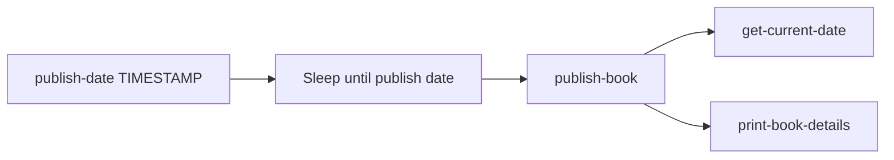

# 20 Timestamps

This standalone Java 21 application registers a workflow that accepts a publish timestamp and book name, waits until the publish timestamp, and passes timestamp data through several tasks.

## Workflow



## What It Demonstrates

- `wf.declareTimestamp("publish-date")` creates a timestamp workflow variable with a default value.
- `wf.sleepUntil(publishDate)` pauses the workflow until the provided timestamp.
- `Instant` is a supported Java representation for a LittleHorse timestamp.
- `publish-book` creates a book with multiple timestamp representations.
- `withRetentionPolicy(...)` retains completed or failed workflow runs for one hour.
- `new LHConfig()` reads the standard LittleHorse `LHC_*` environment configuration.
- Task definitions are registered before the WfSpec, workers are started after registration, and a JVM shutdown hook closes them.

## Prerequisites

- Java 21+
- `lh-standalone:1.2.1` running. See the shared [server prerequisites](../../README.md).
- `lhctl` configured for the same server

## Run

From this directory:

```bash
../../../../gradlew run
```

From the repository root:

```bash
./gradlew -p examples/lh-server/java/20-timestamps run
```

The process stays alive while the workers poll for tasks. Stop it with `Ctrl-C`; the shutdown hook closes both workers.

In another terminal, start a workflow with an ISO-8601 timestamp and book name:

```bash
lhctl run timestamps book-name "My Book" publish-date 2026-01-01T12:00:00Z
```

The `print-book-details` worker prints the book and current timestamp. The retention policy is part of the registered WfSpec and is applied after the run terminates.

## Inspect A Run

```bash
lhctl get wfRun <wfRunId>
lhctl list nodeRun <wfRunId>
lhctl get taskRun <wfRunId> <taskRunGlobalId>
```

`TimestampExample.wfLogic()` authors the WfSpec during startup. `Worker` runs later when a WfRun reaches each task node.

## Source Files

- [`TimestampExample.java`](./src/main/java/io/littlehorse/examples/TimestampExample.java) defines the WfSpec, retention, registration, and lifecycle.
- [`TimestampTasks.java`](./src/main/java/io/littlehorse/examples/TimestampTasks.java) contains runtime task methods.

## Common Failure Modes

- `lhctl whoami` fails: the server is not running or `LHC_*` is not configured.
- A run is stuck at a task: the application worker is not running or the task definition was not registered.
- Timestamp parsing fails: use an ISO-8601 timestamp such as `2026-01-01T12:00:00Z`.
