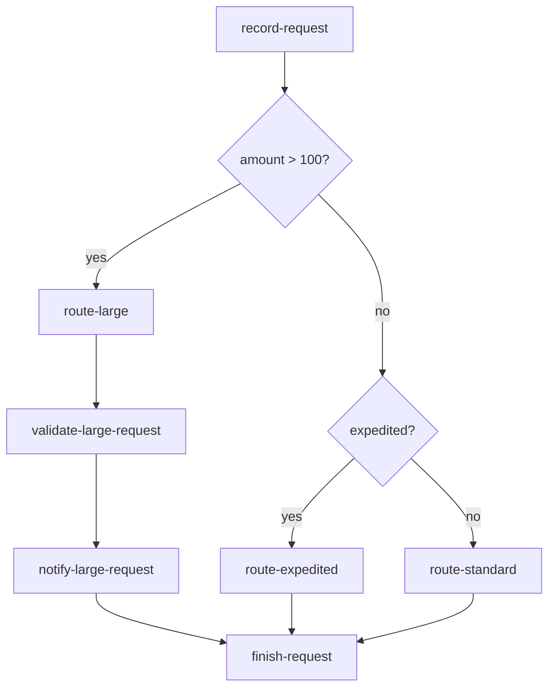

# 25 Conditionals

This standalone Java 21 application registers a workflow with three routing branches. It first records a request, then chooses the first matching branch:

1. `amount > 100` routes to `route-large`, then validates and notifies the request.
2. Otherwise, `expedited == true` routes to `route-expedited`.
3. Otherwise, `route-standard` runs.

The conditions are LittleHorse expressions evaluated while the workflow runs. They are not Java `if` statements evaluated while the WfSpec is being built.

## Workflow



## What It Demonstrates

- Required integer and boolean workflow variables.
- `doIf(...).doElseIf(...).doElse(...)` branching.
- Explicit task retries with `withRetries(1)`.
- One-hour workflow-run retention with `WorkflowRetentionPolicy`.
- `new LHConfig()` for standard `LHC_*` environment configuration.
- Task registration before WfSpec registration, worker startup, and graceful shutdown hooks.

## Prerequisites

- Java 21+
- An accessible LittleHorse Server running. See the shared [server prerequisites](../../README.md).
- `lhctl` configured for the same server

## Run

From this directory:

```bash
../../../../gradlew run
```

From the repository root:

```bash
./gradlew -p examples/lh-server/java/25-conditionals run
```

The application remains running to serve task work. Stop it with `Ctrl-C`; every worker is closed by the JVM shutdown hook.

Run each branch from another terminal:

```bash
# route-large
lhctl run conditionals amount 150 expedited false

# route-expedited
lhctl run conditionals amount 50 expedited true

# route-standard
lhctl run conditionals amount 50 expedited false
```

Inspect any run with:

```bash
lhctl get wfRun <wfRunId>
lhctl list nodeRun <wfRunId>
lhctl get taskRun <wfRunId> <taskRunGlobalId>
```

`ConditionalsExample.getWorkflow()` builds the graph during registration. `ConditionalTasks` executes only after a WfRun reaches a selected task node.

## Source Files

- [`ConditionalsExample.java`](./src/main/java/io/littlehorse/examples/ConditionalsExample.java) defines the branches, retention, and worker lifecycle.
- [`ConditionalTasks.java`](./src/main/java/io/littlehorse/examples/ConditionalTasks.java) contains runtime task methods.

## Common Failure Modes

- `lhctl whoami` fails: the server is not running or `LHC_*` is not configured.
- A run is stuck at a task: the matching worker is not running or its task definition was not registered.
- A branch is unexpected: use integer `amount` and boolean `expedited` values exactly as shown.
