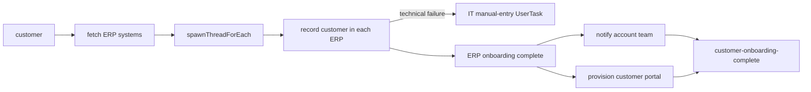

# Customer Onboarding

This standalone Java 21 example models customer onboarding across several ERP
systems. It demonstrates dynamic fanout with `spawnThreadForEach()`, human
remediation with a UserTask, and fixed post-onboarding work with
`spawnThread()`.

## Workflow



## Business Scenario

The workflow receives a new customer identifier, fetches the configured ERP
systems, and records the customer in every system in parallel. A transient ERP
failure is retried. If an ERP still cannot be updated, an IT support UserTask
asks a team member to enter the customer manually before onboarding continues.

Once all ERP records are accounted for, two known independent activities run in
parallel: notifying the account team and provisioning the customer portal.

## Technical Patterns

- `declareArray("erps", String.class)` creates a native LittleHorse `ARRAY`, and `@LHType(isLHArray = true)` keeps the task output in that type instead of `JSON_ARR`.
- `spawnThreadForEach()` creates one `erp-onboarding` child thread per ERP returned by `fetch-erp-systems`.
- `handleAnyFailureOnChild()` routes failed ERP work to the `manual-erp-entry-form` UserTask assigned to `it-support`.
- `spawnThread()` creates the fixed `notify-account-team` and `provision-customer-portal` child threads.
- `waitForThreads()` joins both dynamic ERP work and fixed post-onboarding work.
- Seven-day thread retention and fourteen-day workflow retention preserve operational history.

## Prerequisites

- Java 21 or newer.
- Docker, if running LittleHorse locally.
- `lh-standalone:1.2.1` running. See the shared [server prerequisites](../../README.md).
- `lhctl` configured for the same server, or the `LHC_*` environment variables used by `LHConfig`.

Start the local server if needed:

```sh
docker run --pull always --name lh-standalone --rm -d \
  -p 2023:2023 -p 8080:8080 -p 9092:9092 \
  ghcr.io/littlehorse-enterprises/littlehorse/lh-standalone:1.2.1
lhctl whoami
```

## Run

From `/home/colt/colt-code/lh-developer-hub`:

```sh
./gradlew -p examples/lh-server/java/30-child-threads run
```

The application registers the task definitions, manual-entry form, and
`customer-onboarding` WfSpec, then keeps its workers running.

Start a workflow in another terminal:

```sh
lhctl run customer-onboarding customer acme-123
```

The sample ERP worker intentionally fails for `dynamics`, so the run creates an
IT support UserTask. Find it with:

```sh
lhctl search userTaskRun --userGroup it-support --userTaskStatus UNASSIGNED
```

Assign and complete the task using the identifiers from the search result:

```sh
lhctl assign userTaskRun <wfRunId> <userTaskGuid> --userId it-operator
lhctl execute userTaskRun <wfRunId> <userTaskGuid>
```

Confirm that the customer was entered manually. The two fixed child threads then
run and the workflow completes.

## Inspect a Run

```sh
lhctl get wfRun <wf-run-id>
lhctl list nodeRun <wf-run-id>
lhctl search wfRun byParent <wf-run-id>
```

The child thread runs and join nodes show the ERP fanout, manual remediation,
and fixed post-onboarding work.

## Source Files

- [`ChildThreadsExample.java`](./src/main/java/io/littlehorse/examples/ChildThreadsExample.java) defines the workflow graph and registration.
- [`ChildThreadsWorker.java`](./src/main/java/io/littlehorse/examples/ChildThreadsWorker.java) contains ERP and post-onboarding task methods.
- [`ManualErpEntryForm.java`](./src/main/java/io/littlehorse/examples/ManualErpEntryForm.java) defines the IT remediation form.

## Common Failure Modes

- `lhctl whoami` fails: the standalone server is not running or `LHC_*` is not configured.
- A run is stuck at a task: the worker is not running or the task definition was not registered.
- A run is waiting on the IT task: assign and complete the `manual-erp-entry-form` UserTask.
- Multiple workflow starts fail during registration if immutable task definitions from an older version are already registered; use a clean tenant or matching task definitions.
