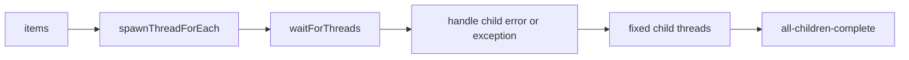

# 30 Child Threads

This standalone Java 21 example shows how one workflow can fan work out to typed child threads and then join them. It demonstrates:

- `spawnThreadForEach()` over a typed `Array<STR>`.
- Two fixed child threads created with `spawnThread()`.
- A technical child error handled with `handleErrorOnChild()`.
- A named business exception handled with `handleExceptionOnChild()`.
- A graceful worker shutdown hook.
- Seven-day thread retention and fourteen-day workflow retention.

## Workflow



## Prerequisites

- Java 21 or newer.
- Docker, if running LittleHorse locally.
- `lh-standalone:1.2.1` running. See the shared [server prerequisites](../../README.md).
- `lhctl` configured for the same server, or the `LHC_*` environment variables used by `LHConfig`.

Start the local server if needed:

```sh
docker run --pull always --name lh-standalone --rm -d \
  -p 2023:2023 -p 8080:8080 -p 9092:9092 \
  ghcr.io/littlehorse-enterprises/littlehorse/lh-standalone:1.2.1
lhctl whoami
```

## Run

From this directory:

```sh
../../../../gradlew run
```

The application registers the task definitions and the `child-threads` WfSpec, then keeps its workers running.

In another terminal, provide a typed string array as the workflow input:

```sh
lhctl run child-threads items '["alpha", "beta", "decline", "explode"]'
```

`decline` takes the named `child-declined` exception path. `explode` makes its task throw a technical failure, which the child failure handler records. The two fixed children run for every workflow run.

## Inspect a Run

Use the workflow run ID printed by `lhctl`:

```sh
lhctl get wfRun <wf-run-id>
lhctl list nodeRun <wf-run-id>
lhctl get taskRun <wf-run-id> <task-run-global-id>
```

The child thread runs and their join node show that child work completes before the final `all-children-complete` task.

`ChildThreadsExample.getWorkflow()` authors the thread graph during WfSpec registration. `ChildThreadsWorker` executes task methods later as each WfRun and child thread advances.

## Source Files

- [`ChildThreadsExample.java`](./src/main/java/io/littlehorse/examples/ChildThreadsExample.java) defines fanout, joins, and child failure handlers.
- [`ChildThreadsWorker.java`](./src/main/java/io/littlehorse/examples/ChildThreadsWorker.java) contains runtime task methods.

## Common Failure Modes

- `lhctl whoami` fails: the standalone server is not running or `LHC_*` is not configured.
- A run is stuck at a task: the worker is not running or the task definition was not registered.
- A child is declined or fails technically: inspect the child node runs and the corresponding parent handler node.
