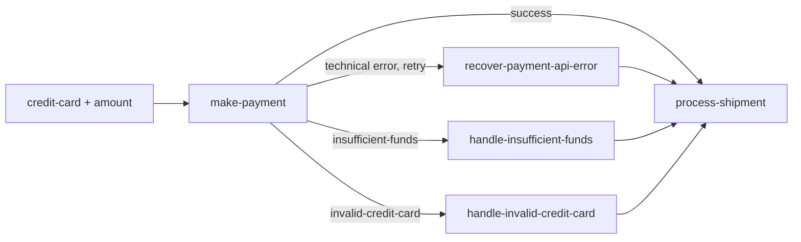

# 35 Task Failures

This standalone Java 21 application demonstrates the difference between technical task errors and named business exceptions in a payment workflow. The workflow passes a credit card and amount to a flaky third-party payment API, handles the relevant failure, and then proceeds to `process-shipment`.

## Scenarios

- The payment task accepts `credit-card` and `amount`, like a payment provider API.
- Card `4000000000009995` simulates an insufficient-funds rejection. After a successful API call, `make-payment` throws an `LHTaskException` named `payment-rejected` with `insufficient-funds` content, and the workflow runs `handle-insufficient-funds`.
- Card `4000000000000002` simulates an invalid-card rejection. After a successful API call, `make-payment` throws an `LHTaskException` named `payment-rejected` with `invalid-credit-card` content, and the workflow runs `handle-invalid-credit-card`.
- Any other card simulates a successful payment. The simulated API fails randomly 50% of the time before returning, so the task may be retried or handled as a technical error.

Business exceptions are named workflow outcomes, not technical errors. They are not retried, even though the payment node has a retry policy. Use `RuntimeException` for transient third-party API failures; use `LHTaskException` when the payment is rejected for a business reason. The API simulation is intentionally flaky, failing 50% of the time with a `RuntimeException`.

## Workflow



## What It Demonstrates

- `WorkerContext.getAttemptNumber()` in the payment, recovery, and finish tasks.
- `handleError(...)` for a technical failure after task retries are exhausted.
- `handleException(..., exceptionName, ...)` plus handler conditionals for exception content.
- `LHTaskException` content, name, and message.
- One-hour workflow-run retention with `WorkflowRetentionPolicy`.
- `new LHConfig()` for standard `LHC_*` environment configuration.
- Task registration before WfSpec registration, worker startup, and graceful shutdown hooks.

## Prerequisites

- Java 21+
- `lh-standalone:1.2.1` running. See the shared [server prerequisites](../../README.md).
- `lhctl` configured for the same server

## Run

From this directory:

```bash
../../../../gradlew run
```

From the repository root:

```bash
./gradlew -p examples/lh-server/java/35-task-failures run
```

The application remains running to serve task work. Stop it with `Ctrl-C`; the shutdown hook closes every worker.

Run the payment examples from another terminal. The payment API failure is random, so retry the commands if you want to observe each path:

```bash
lhctl run task-failures credit-card 4242424242424242 amount 1000
lhctl run task-failures credit-card 4000000000009995 amount 1000
lhctl run task-failures credit-card 4000000000000002 amount 1000
```

Inspect the WfRun and its node/task runs with the usual `lhctl get wfRun`, `lhctl list nodeRun`, and `lhctl get taskRun` commands. The task worker output shows each attempt and the business exception fields.

`TaskFailuresExample.wfLogic()` authors the retry and handler graph. `TaskFailureTasks` runs later in workers; retries apply to technical API failures, not named business exceptions.

## Source Files

- [`TaskFailuresExample.java`](./src/main/java/io/littlehorse/examples/TaskFailuresExample.java) defines payment inputs, retries, failure handlers, and lifecycle.
- [`TaskFailureTasks.java`](./src/main/java/io/littlehorse/examples/TaskFailureTasks.java) contains the flaky payment API simulation and recovery tasks.

## Common Failure Modes

- `lhctl whoami` fails: the server is not running or `LHC_*` is not configured.
- A run is stuck at `make-payment`: the worker is not running or its task definition was not registered.
- A `payment-rejected` outcome has no retry: this is intentional because `LHTaskException` is a business outcome.
