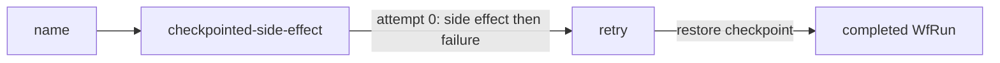

# 40 Checkpoint Tasks

This standalone Java 21 example demonstrates how `WorkerContext.executeAndCheckpoint()` makes a side effect durable across task retries. The task logs execution metadata, performs a side effect inside a checkpoint, and then intentionally fails after that checkpoint on attempt zero.

## Workflow



## Prerequisites

- Java 21 or newer.
- Docker, if running LittleHorse locally.
- A compatible LittleHorse Server running. See the shared [server setup](../../README.md#littlehorse-server-version).
- `lhctl` configured for the same server, or the `LHC_*` environment variables used by `LHConfig`.

## Run

From this directory:

```sh
../../../../gradlew run
```

The application registers the `checkpointed-side-effect` task and the `checkpoint-tasks` WfSpec, then starts the worker.

In another terminal, run the workflow:

```sh
lhctl run checkpoint-tasks name "Qui-Gon Jinn"
```

The task allows two retries. On attempt zero it prints the side effect and then fails after the checkpoint. On the retry, LittleHorse restores the checkpoint result without executing the side effect again, and the task completes.

The worker also prints `wfRun`, `taskRun`, and `attempt` metadata from `WorkerContext`. The checkpoint callback writes a checkpoint log entry with `checkpointContext.log()`.

## Inspect a Run

Use the workflow run ID printed by `lhctl`:

```sh
lhctl get wfRun <wf-run-id>
lhctl list nodeRun <wf-run-id>
lhctl get taskRun <wf-run-id> <task-run-global-id>
```

The task run shows the failed first attempt and successful retry. Stop the application with `Ctrl-C`; its shutdown hook closes the worker cleanly.

`CheckpointTasksExample.getWorkflow()` authors the task node and retry policy. `CheckpointTasksWorker` executes the side effect and reads `WorkerContext` only when a WfRun reaches that node.

## Source Files

- [`CheckpointTasksExample.java`](./src/main/java/io/littlehorse/examples/CheckpointTasksExample.java) defines the WfSpec, retention, and worker lifecycle.
- [`CheckpointTasksWorker.java`](./src/main/java/io/littlehorse/examples/CheckpointTasksWorker.java) contains the checkpointed side effect.

## Common Failure Modes

- `lhctl whoami` fails: the standalone server is not running or `LHC_*` is not configured.
- A run is stuck at the task: the worker is not running or the task definition was not registered.
- The side effect prints twice: verify that the task uses `executeAndCheckpoint()` and that the same task run is being inspected.
