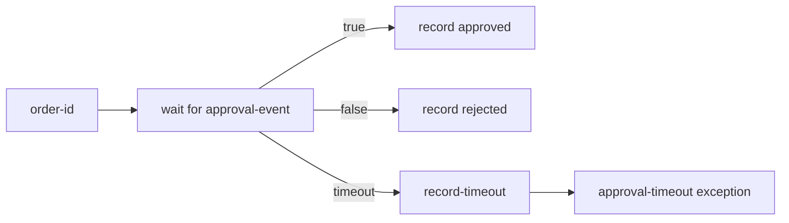

# 45 External Events

This standalone Java 21 example waits for a typed, correlated external event. The event content is a Boolean approval, and the workflow uses that value to produce an explicit semantic result. It also demonstrates both valid publication orders for a `PutCorrelatedEventRequest`:

- Publish the correlated event before starting the matching workflow run.
- Start the workflow run first, then publish the correlated event.

The wait has a fifteen-second timeout. A timeout runs a handler task and ends the workflow with the named `approval-timeout` business exception.

## Workflow



## Prerequisites

- Java 21 or newer.
- Docker, if running LittleHorse locally.
- `lh-standalone:1.2.1` running. See the shared [server prerequisites](../../README.md).
- `lhctl` configured for the same server, or the `LHC_*` environment variables used by `LHConfig`.

Start the local server if needed:

```sh
docker run --pull always --name lh-standalone --rm -d \
  -p 2023:2023 -p 8080:8080 -p 9092:9092 \
  ghcr.io/littlehorse-enterprises/littlehorse/lh-standalone:1.2.1
lhctl whoami
```

## Run

From this directory:

```sh
../../../../gradlew run
```

The application registers the typed `approval-event` definition and the `external-events` WfSpec. It then creates two demo runs with unique keys: one receives its event before the run starts, and the other receives its event after the run starts. The task workers remain running for additional manual runs.

To choose stable keys for the two demos, pass them as application arguments:

```sh
../../../../gradlew run --args='before-order-123 after-order-456'
```

To run the workflow yourself without posting an event, use a unique key and wait for the timeout:

```sh
lhctl run external-events order-id timeout-order-123
```

To complete a manually started run, post a Boolean correlated event. The key must match the workflow's `order-id`:

```sh
lhctl put correlatedEvent timeout-order-123 approval-event BOOL true
```

Use `false` to exercise the rejected semantic result.

## Inspect a Run

Use the workflow run ID printed by `lhctl`:

```sh
lhctl get wfRun <wf-run-id>
lhctl list nodeRun <wf-run-id>
lhctl get taskRun <wf-run-id> <task-run-global-id>
```

On a normal event, the typed Boolean is stored in `approved`, the workflow records approved or rejected, and `semantic-result` returns `APPROVED: <order-id>` or `REJECTED: <order-id>`. On timeout, inspect the named `approval-timeout` exception and the `record-timeout` task.

`ExternalEventsExample.buildWorkflow()` authors the event wait and handlers. `ExternalEventsWorker` executes runtime tasks, while `PutCorrelatedEventRequest` delivers an event to the server independently of the WfSpec authoring code.

## Source Files

- [`ExternalEventsExample.java`](./src/main/java/io/littlehorse/examples/ExternalEventsExample.java) defines the event, workflow, demo runs, and lifecycle.
- [`ExternalEventsWorker.java`](./src/main/java/io/littlehorse/examples/ExternalEventsWorker.java) contains runtime task methods.

## Common Failure Modes

- `lhctl whoami` fails: the standalone server is not running or `LHC_*` is not configured.
- The event is not consumed: the correlation key must exactly match `order-id` and the event name must be `approval-event`.
- A run times out: the fifteen-second timeout is intentional; inspect `record-timeout` and the `approval-timeout` exception.
