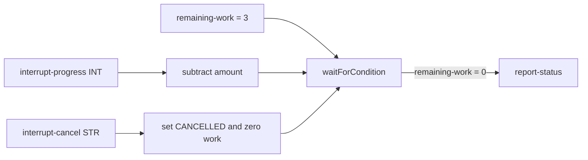

# 50 Interrupts

This example demonstrates interrupt handlers that receive typed primitive payloads, mutate state in the interrupted parent thread, and unblock a `waitForCondition` node.

## Workflow

The `interrupts-demo` workflow starts with three units of remaining work:

```text
remaining-work = 3
        |
        v
  waitForCondition(remaining-work == 0)
```

It registers two interrupt events:

| Event | Payload | Handler behavior |
| --- | --- | --- |
| `interrupt-progress` | `Integer` | Subtracts the payload from the parent's `remaining-work`. |
| `interrupt-cancel` | `String` | Stores `CANCELLED` in the parent's `status` and sets remaining work to zero. |

Each handler declares its payload as `WorkflowThread.HANDLER_INPUT_VAR`. The handler runs as a separate thread, but assignments to `remaining-work` and `status` mutate variables declared by the parent thread. Since interrupt payload types in client `1.2.1` are primitive wrapper types, this example uses `Integer` and `String` rather than a custom payload class.

After the condition is satisfied, the workflow reports the final status and completes. The workflow retains completed runs for 24 hours and thread records for one hour after termination.

## Workflow



## Prerequisites

- Java 21+
- `lh-standalone:1.2.1` running. See the shared [server prerequisites](../../README.md).
- `lhctl` configured for that server

The module is independent: it uses `io.littlehorse:littlehorse-client:1.2.1`, its own Java 21 toolchain, and `new LHConfig()`. `new LHConfig()` reads the `LHC_*` environment variables.

## Run

From this directory:

```bash
../../../../gradlew run
```

Startup registers the task definitions, interrupt event definitions, and WfSpec before starting the workers. Stop the process with Ctrl-C; the shutdown hook closes every worker.

## Try It

Start a run in another terminal:

```bash
lhctl run interrupts-demo
```

Post one unit of progress three times. Replace `<wf_run_id>` with the ID returned by `lhctl`:

```bash
lhctl postEvent <wf_run_id> interrupt-progress INT 1
lhctl postEvent <wf_run_id> interrupt-progress INT 1
lhctl postEvent <wf_run_id> interrupt-progress INT 1
```

Or cancel the run immediately with a string reason:

```bash
lhctl postEvent <wf_run_id> interrupt-cancel STR operator-request
```

Inspect the run and its nodes:

```bash
lhctl get wfRun <wf_run_id>
lhctl list nodeRun <wf_run_id>
```

`InterruptsExample.buildWorkflow()` authors the condition and interrupt handler threads. `InterruptTasks` runs only at the task nodes reached by the WfRun; interrupt delivery and state mutation are performed by the server.

## Source Files

- [`InterruptsExample.java`](./src/main/java/io/littlehorse/examples/InterruptsExample.java) defines handlers, retention, and worker lifecycle.
- [`InterruptTasks.java`](./src/main/java/io/littlehorse/examples/InterruptTasks.java) contains runtime task methods.

## Common Failure Modes

- `lhctl whoami` fails: the server is not running or `LHC_*` is not configured.
- An interrupt is ignored: use the exact WfRun ID and event name, and send `INT` or `STR` matching the handler payload.
- The condition does not unblock: progress must reduce `remaining-work` to zero; cancellation sets it to zero directly.
