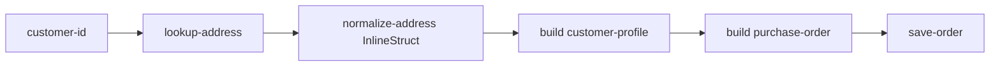

# 55 Structs

This example builds nested LittleHorse structs in a WfSpec and passes them to typed Java task methods.

## Struct Definitions

The annotated POJOs form a nested schema:

```text
PurchaseOrder
  +-- CustomerProfile
  |     +-- Address
  +-- LineItem
```

The corresponding StructDef names are `purchase-order`, `customer-profile`, `address`, and `line-item`. They are registered in dependency order so nested definitions exist before the definitions that reference them.

## Workflow

The `nested-structs-demo` workflow requires `customer-id`, `order-id`, `sku`, and `quantity` variables.

1. `lookup-address` returns a typed `Address` POJO.
2. `normalize-address` accepts and returns a typed `InlineStruct`. Its parameter and return value use `@LHType(structDefName = "address")`.
3. `buildStruct("customer-profile")` assembles a `CustomerProfile` from workflow values.
4. `buildInlineStruct()` creates the nested `Address` and `LineItem` values.
5. `customer.get("address").get("city")` demonstrates nested field access on a `WfRunVariable`, while `normalizedAddress.get("city")` accesses a field on a `NodeOutput`.
6. `save-order` receives the completed `PurchaseOrder` POJO.

The workflow retains completed runs for 24 hours and thread records for one hour after termination.

## Workflow



## Prerequisites

- Java 21+
- `lh-standalone:1.2.1` running. See the shared [server prerequisites](../../README.md).
- `lhctl` configured for that server

The module is independent: it uses `io.littlehorse:littlehorse-client:1.2.1`, its own Java 21 toolchain, and `new LHConfig()`. `new LHConfig()` reads the `LHC_*` environment variables.

## Run

From this directory:

```bash
../../../../gradlew run
```

Startup registers the nested StructDefs, task definitions, and WfSpec before starting the workers. Stop the process with Ctrl-C; the shutdown hook closes every worker.

## Try It

Start a run in another terminal. `lhctl` uses the WfSpec variable names as the arguments:

```bash
lhctl run nested-structs-demo \
  customer-id C-42 \
  order-id O-100 \
  sku holocron \
  quantity 2
```

Inspect the run and task nodes:

```bash
lhctl get wfRun <wf_run_id>
lhctl list nodeRun <wf_run_id>
lhctl list taskRun <wf_run_id>
```

`StructsExample.buildWorkflow()` authors the typed struct graph and field access expressions. `StructTasks` receives decoded POJOs and `InlineStruct` values later when the WfRun reaches each task node.

## Source Files

- [`StructsExample.java`](./src/main/java/io/littlehorse/examples/StructsExample.java) defines and registers the nested struct workflow.
- [`StructTasks.java`](./src/main/java/io/littlehorse/examples/StructTasks.java) contains runtime struct task methods.
- [`CustomerProfile.java`](./src/main/java/io/littlehorse/examples/CustomerProfile.java), [`Address.java`](./src/main/java/io/littlehorse/examples/Address.java), [`LineItem.java`](./src/main/java/io/littlehorse/examples/LineItem.java), and [`PurchaseOrder.java`](./src/main/java/io/littlehorse/examples/PurchaseOrder.java) define the annotated schemas.

## Common Failure Modes

- `lhctl whoami` fails: the server is not running or `LHC_*` is not configured.
- Struct registration fails: register nested definitions on a clean development tenant or use compatible existing definitions.
- A run is stuck at a task: the worker is not running or the task definition was not registered.
