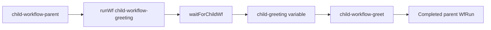

# Child Workflows

This example teaches workflow-run orchestration with `runWf()` and
`waitForChildWf()`. The parent passes a typed string input to a child WfSpec,
waits for the child to complete, and uses the child's string output in another
task.

## Workflow



The child WfSpec is independent metadata. `runWf()` creates a child WfRun at
runtime; the Java lambda only builds the WfSpec graph. The parent keeps the
`SpawnedChildWf` handle so `waitForChildWf()` can wait for that exact run.

## Prerequisites

- Java 21.
- A running `lh-standalone:1.2.1` LittleHorse server, as described in
  [`examples/lh-server/README.md`](../../README.md).
- `lhctl` configured for that server.

## Run

From `/home/colt/colt-code/lh-developer-hub`:

```bash
gradle -p examples/lh-server/java/60-child-workflows run
```

The application registers `child-workflow-greet`, then the child WfSpec, then
the parent WfSpec, and finally starts its worker.

In another terminal, start a parent WfRun:

```bash
lhctl run child-workflow-parent name anakin --wfRunId child-parent-demo
```

Expected worker output includes:

```text
child-workflow-greet -> hello from child workflow, anakin
child-workflow-greet -> hello from child workflow, hello from child workflow, anakin
```

The first line is the child task. The second is the parent's task consuming
the child output. The server-generated child ID is visible in the parent
WfRun's `runChildWf` node result.

Inspect both workflow runs and the parent variable:

```bash
lhctl get wfRun child-parent-demo
lhctl list nodeRun child-parent-demo
lhctl get variable child-parent-demo 0 child-greeting
```

Use the child WfRun ID reported by the parent when inspecting the child:

```bash
lhctl get wfRun <child-wf-run-id>
lhctl list nodeRun <child-wf-run-id>
```

## Important Source Files

- [`ChildWorkflowExample.java`](./src/main/java/io/littlehorse/examples/ChildWorkflowExample.java)
  defines both WfSpecs, registration order, and worker lifecycle.

Workflow-authoring calls run during registration. `GreetingTasks.greet()` runs
later in the worker process when a WfRun reaches a task node.

## Common Failure Modes

- `TASK_NOT_FOUND` or a stuck task means the application worker is not running
  or the task definition was not registered.
- A connection error means `lh-standalone:1.2.1` is not running or `LHConfig`
  environment variables do not point at it.
- Starting the parent before this application registers both WfSpecs can leave
  the run waiting for metadata; restart the run after registration.
