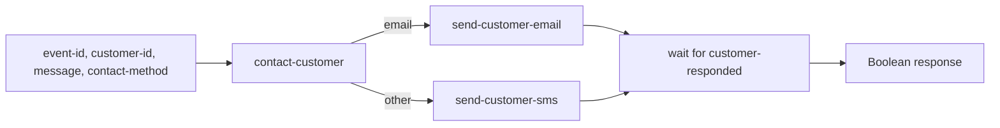
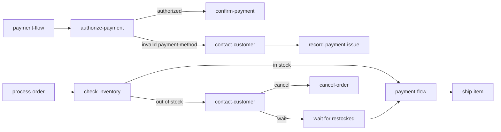

# Child Workflows

This example shows how one reusable child workflow can encapsulate a customer
communication process and be used by multiple parent workflows. `payment-flow`
uses `contact-customer` when a payment method is invalid. `process-order` uses
the same child when an item is unavailable, then waits for a restock event
before payment and shipment.

## Reusable Child Workflow

`contact-customer` accepts these inputs:

- `event-id`: correlation key for the customer response.
- `customer-id`: customer receiving the message.
- `message`: message to send.
- `contact-method`: `email` or any other value for the SMS branch.

The child has two branches. Both send a message and then wait for the same
correlated `customer-responded` event before completing with its Boolean
response:



## Parent Workflows



The same child WfSpec is referenced by both parents, but each invocation is a
separate child WfRun. The parent keeps the `SpawnedChildWf` handle and waits
for that exact child with `waitForChildWf()`. `process-order` also invokes
`payment-flow` as a child workflow, so payment authorization remains reusable
and independently inspectable.

## Prerequisites

- Java 21.
- A running `lh-standalone:1.2.1` LittleHorse server, as described in
  [`examples/lh-server/README.md`](../../README.md).
- `lhctl` configured for that server.

## Run

From `/home/colt/colt-code/lh-developer-hub`:

```bash
./gradlew -p examples/lh-server/java/60-child-workflows run
```

The application registers the `customer-responded` event, task definitions,
the reusable child WfSpec, and both parent WfSpecs before starting workers.

Start a payment flow with an invalid payment method. It pauses in
`contact-customer` until the customer responds:

```bash
lhctl run payment-flow \
  event-id payment-contact-123 \
  customer-id customer-123 \
  payment-method invalid \
  contact-method email \
  amount 1000 \
  --wfRunId payment-demo
```

Start an order flow with an out-of-stock item. It first asks whether the
customer wants to wait:

```bash
lhctl run process-order \
  event-id order-contact-123 \
  order-id order-123 \
  customer-id customer-123 \
  item out-of-stock \
  contact-method sms \
  payment-method valid \
  amount 1000 \
  --wfRunId order-demo
```

Publish a Boolean customer response using the child invocation's `event-id`.
For the payment run, `false` or `true` records the customer's response and
completes the payment flow. For the order run, `false` cancels the order:

```bash
lhctl put correlatedEvent payment-contact-123 customer-responded BOOL true
lhctl put correlatedEvent order-contact-123 customer-responded BOOL false
```

If the order customer wants to wait, publish `true`, then publish the
correlated restock event using the order ID:

```bash
lhctl put correlatedEvent order-contact-123 customer-responded BOOL true
lhctl put correlatedEvent order-123 restocked BOOL true
```

After restocking, `process-order` starts `payment-flow`; with
`payment-method valid`, it completes payment and ships the item. Use an item
other than `out-of-stock` to skip the restock branch.

## Inspect Runs

Inspect either parent and its child WfRun:

```bash
lhctl get wfRun payment-demo
lhctl list nodeRun payment-demo
lhctl get wfRun order-demo
lhctl list nodeRun order-demo
```

The parent WfRun shows the `runChildWf` node and the child WfRun ID. Use that ID
to inspect the reusable workflow's task and event nodes:

```bash
lhctl get wfRun <child-wf-run-id>
lhctl list nodeRun <child-wf-run-id>
```

## Important Source Files

- [`ContactCustomerWorkflow.java`](./src/main/java/io/littlehorse/examples/ContactCustomerWorkflow.java)
  defines the reusable customer-contact child WfSpec.
- [`PaymentFlowWorkflow.java`](./src/main/java/io/littlehorse/examples/PaymentFlowWorkflow.java)
  defines the payment parent WfSpec.
- [`ProcessOrderWorkflow.java`](./src/main/java/io/littlehorse/examples/ProcessOrderWorkflow.java)
  defines the order parent WfSpec and its restock flow.
- [`ExampleTasks.java`](./src/main/java/io/littlehorse/examples/ExampleTasks.java)
  contains the task implementations shared by the WfSpecs.
- [`ChildWorkflowExample.java`](./src/main/java/io/littlehorse/examples/ChildWorkflowExample.java)
  registers the event definitions, WfSpecs, workers, and lifecycle.

Workflow-authoring calls run during registration. The task methods and
customer response event run later when a WfRun reaches those nodes.

## Common Failure Modes

- `TASK_NOT_FOUND` or a stuck task means the application worker is not running
  or its task definition was not registered.
- A response is not consumed when the event key does not exactly match the
  child's `event-id`.
- A parent remains waiting after a response when the response was published
  with the wrong event name or a non-Boolean content type.
- A connection error means `lh-standalone:1.2.1` is not running or `LHConfig`
  environment variables do not point at it.
