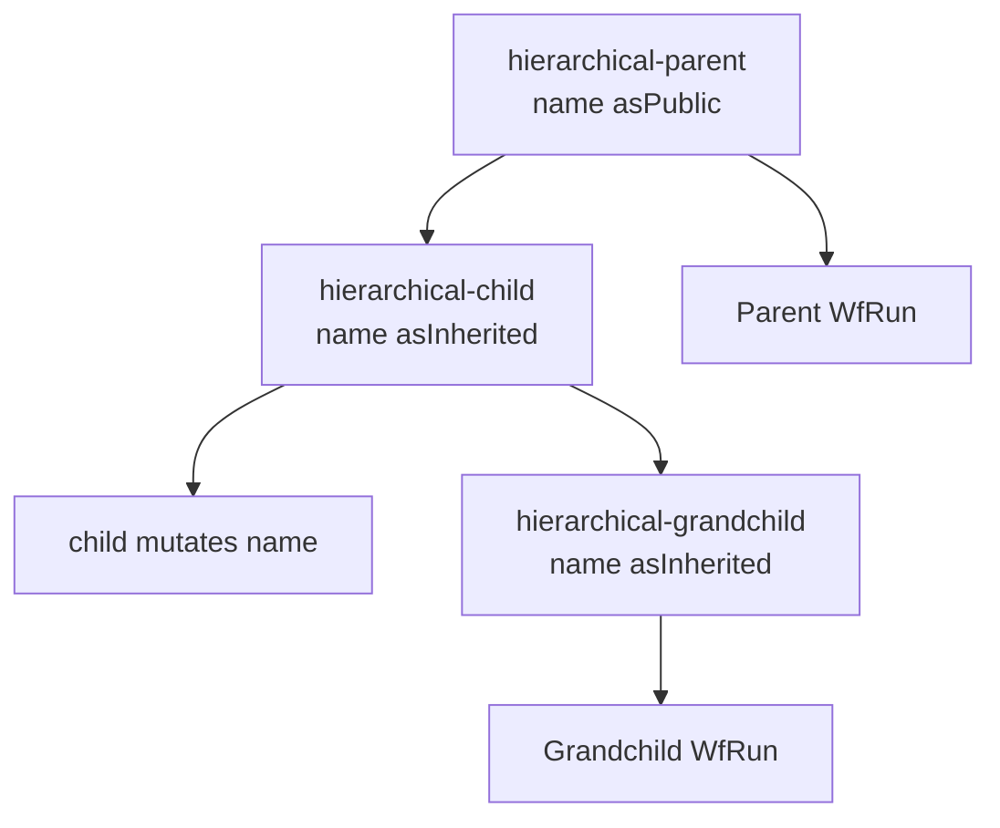

# Hierarchical Workflows

This example teaches the difference between a WfSpec hierarchy and child-run
orchestration. `setParent()` constrains which WfRun may be the parent. A public
variable in the parent is visible to a child declared with `asInherited()`.
Unlike example 60, this example does not call `runWf()`; the three WfRuns are
started explicitly with `--parentWfRunId`.

## Workflow



The parent exposes `name` with `.asPublic()`. Both descendants declare the
same variable with `.asInherited()`. The child changes that shared variable to
`updated-by-child`, which can be inspected on the parent hierarchy.

## Prerequisites

- Java 21.
- A running `lh-standalone:1.2.1` LittleHorse server, as described in
  [`examples/lh-server/README.md`](../../README.md).
- `lhctl` configured for that server.

## Run

From `/home/colt/colt-code/lh-developer-hub`:

```bash
./gradlew -p examples/lh-server/java/65-hierarchical-workflows run
```

Start the parent, then explicitly attach each descendant:

```bash
lhctl run hierarchical-parent name obi-wan --wfRunId hierarchy-parent-demo
lhctl run hierarchical-child --parentWfRunId hierarchy-parent-demo --wfRunId hierarchy-child-demo
lhctl run hierarchical-grandchild --parentWfRunId hierarchy-parent-demo_hierarchy-child-demo --wfRunId hierarchy-grandchild-demo
```

Expected worker output is similar to:

```text
hierarchical-greet -> hello from hierarchy, obi-wan
hierarchical-greet -> hello from hierarchy, updated-by-child
```

Inspect status and inherited state:

```bash
lhctl get wfRun hierarchy-parent-demo
lhctl get wfRun hierarchy-parent-demo_hierarchy-child-demo
lhctl get wfRun hierarchy-parent-demo_hierarchy-child-demo_hierarchy-grandchild-demo
lhctl get variable hierarchy-parent-demo 0 name
lhctl get variable hierarchy-parent-demo_hierarchy-child-demo 0 name
```

The server stores hierarchical child IDs as parent/child composites, so use
those composite IDs for `get` and for a nested `--parentWfRunId`. A child run
whose parent WfRun belongs to another WfSpec is rejected by the server.

## Important Source Files

- [`HierarchicalWorkflowExample.java`](./src/main/java/io/littlehorse/examples/HierarchicalWorkflowExample.java)
  defines parent constraints, visibility, registration order, and lifecycle.

The Java methods build WfSpec graphs at startup. `GreetingTasks.greet()` is
runtime code executed later by the task worker.

## Common Failure Modes

- A parent-ID validation error means the `--parentWfRunId` points to the wrong
  WfSpec or the parent WfSpec was not registered first.
- `TASK_NOT_FOUND` or a stuck run means the application worker is not running.
- A connection error means `lh-standalone:1.2.1` is not running or `LHConfig`
  environment variables are not configured for the server.
