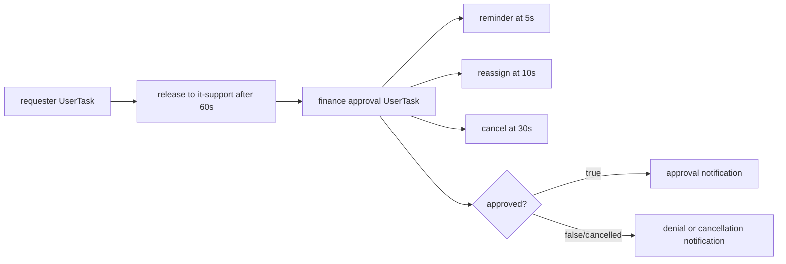

# User Tasks

This example demonstrates typed form definitions and human steps in a
workflow. A requester fills in an item request, Finance receives a group task
with notes, and the workflow sends a notification for approval or denial. The
example also schedules a reminder, releases the first task to a group,
reassigns the approval, cancels an overdue approval, and handles named
cancellation exceptions.

## Workflow



`UserTaskSchema` compiles the Java form classes into `UserTaskDef` metadata.
The task worker only handles notification tasks; a human completes the form
through a UI or `lhctl`. A `UserTaskOutput` is a JSON object because that is
the server representation of form fields.

## Prerequisites

- Java 21.
- A running `lh-standalone:1.2.1` LittleHorse server, as described in
  [`examples/lh-server/README.md`](../../README.md).
- `lhctl` configured for that server.

## Run

From `/home/colt/colt-code/lh-developer-hub`:

```bash
./gradlew -p examples/lh-server/java/70-user-tasks run
```

The application registers the notification task, both form schemas, and the
WfSpec before starting the worker. Start a request in another terminal:

```bash
lhctl run purchase-approval user-id anakin --wfRunId purchase-approval-demo
```

Find the requester task:

```bash
lhctl search userTaskRun --userId anakin --userTaskStatus ASSIGNED
lhctl get wfRun purchase-approval-demo
lhctl list nodeRun purchase-approval-demo
```

Complete the task using its `wfRunId` and `userTaskGuid` from the search result:

```bash
lhctl execute userTaskRun <wfRunId> <userTaskGuid>
```

Enter `anakin`, an item, and a justification when prompted. The workflow then
creates the Finance group task. Inspect and assign it:

```bash
lhctl search userTaskRun --userGroup finance --userTaskStatus UNASSIGNED
lhctl assign userTaskRun <wfRunId> <userTaskGuid> --userId mace
lhctl execute userTaskRun <wfRunId> <userTaskGuid>
```

Enter `true` to see an approval notification or `false` to see a denial
notification. The terminal output is similar to:

```text
Notification to anakin: Approved: laptop
```

To exercise cancellation instead, start another run and complete only its
requester task. Let the approval task reach its 30-second cancellation trigger:

```bash
lhctl run purchase-approval user-id anakin --wfRunId purchase-approval-cancel-demo
lhctl get userTaskRun <wfRunId> <userTaskGuid>
lhctl get wfRun purchase-approval-cancel-demo
```

The named `purchase-approval-cancelled` exception is handled by the workflow,
and a cancellation notification is printed. Reminder and reassignment events
are visible in the `UserTaskRun` event history.

## Important Source Files

- [`UserTasksExample.java`](./src/main/java/io/littlehorse/examples/UserTasksExample.java)
  defines assignment, notes, timers, cancellation, and branching.
- [`ItemRequestForm.java`](./src/main/java/io/littlehorse/examples/ItemRequestForm.java)
  defines the requester form.
- [`ApprovalForm.java`](./src/main/java/io/littlehorse/examples/ApprovalForm.java)
  defines the Finance form.
- [`NotificationTasks.java`](./src/main/java/io/littlehorse/examples/NotificationTasks.java)
  contains runtime notification logic.

The WfSpec lambda authors a graph; form completion and notification execution
happen later at runtime.

## Common Failure Modes

- No task appears when searching if the application did not register both
  `UserTaskDef`s or the run used the wrong tenant.
- A notification task stuck in `SCHEDULED` means this module's worker is not
  running.
- A connection error means `lh-standalone:1.2.1` is not running or `LHConfig`
  environment variables are not configured for the server.
- A user-task command must use the composite ID values from the search result,
  not the form definition name alone.
