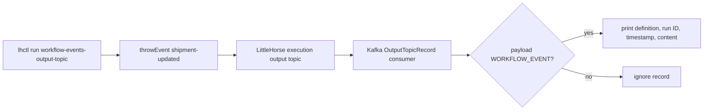

# Workflow Events Through Kafka

This example teaches asynchronous downstream consumption of a LittleHorse
`WorkflowEvent`. The WfSpec emits a typed event with `wf.throwEvent()` and the
application consumes the standalone server's execution output topic. It never
performs a synchronous workflow-event wait RPC; consumers receive the event from Kafka alongside
other execution records and filter the `WORKFLOW_EVENT` payload case.

## Workflow



`OutputTopicConfig` enables output publishing for the configured tenant. The
workflow event's definition, WfRun ID, timestamp, and typed string content are
read from the decoded `OutputTopicRecord`. Kafka is an asynchronous integration
boundary: the workflow emits the event while the consumer independently reads
it later.

## Prerequisites

- Java 21.
- A running `lh-standalone:1.2.1` LittleHorse server, as described in
  [`examples/lh-server/README.md`](../../README.md). The standalone image must
  expose Kafka at `localhost:9092` from the machine running this example.
- `lhctl` configured for that server.
- Kafka output topics enabled by this application for the selected tenant.

## Run

From `/home/colt/colt-code/lh-developer-hub`, using the standalone defaults:

```bash
LH_KAFKA_BOOTSTRAP_SERVERS=localhost:9092 LH_TENANT_ID=default LH_CLUSTER_NAME=cluster1 ./gradlew -p examples/lh-server/java/75-workflow-events-output-topic run
```

The application registers the WfSpec and prints:

```text
Listening for WORKFLOW_EVENT records on cluster1_default_execution via localhost:9092 (tenant default).
```

In another terminal, drive the workflow:

```bash
lhctl run workflow-events-output-topic shipment-id shipment-123 --wfRunId workflow-event-demo
```

Expected consumer output is similar to:

```text
WorkflowEvent definition=shipment-updated wfRunId=workflow-event-demo timestamp=... content={"str":"Shipment shipment-123 is ready"}
```

The topic can contain task, WfRun, variable, or user-task records as well;
only records whose `payload` is `WORKFLOW_EVENT` are printed.

## Configuration

The application uses these environment variables:

- `LH_KAFKA_BOOTSTRAP_SERVERS`, default `localhost:9092`.
- `LH_TENANT_ID`, default `default`.
- `LH_CLUSTER_NAME`, default `cluster1`; used to derive the topic name.
- `LH_OUTPUT_TOPIC`, optional explicit execution topic override.
- `LH_KAFKA_GROUP_ID`, default `workflow-events-output-topic-example`.

If a standalone deployment uses a different topic name, set
`LH_OUTPUT_TOPIC` explicitly. For a non-default tenant, run `lhctl` against the
same tenant and set `LH_TENANT_ID` to that ID.

Inspect the completed WfRun and its emitted event through the server API:

```bash
lhctl get wfRun workflow-event-demo
lhctl list nodeRun workflow-event-demo
```

The Kafka command-line equivalent for checking the raw topic requires `kcat`:

```bash
kcat -b "${LH_KAFKA_BOOTSTRAP_SERVERS:-localhost:9092}" -t "${LH_OUTPUT_TOPIC:-${LH_CLUSTER_NAME:-cluster1}_${LH_TENANT_ID:-default}_execution}" -C -o -1
```

The Java consumer is preferred because it deserializes the protobuf and
filters the payload case safely.

## Important Source Files

- [`WorkflowEventsOutputTopicExample.java`](./src/main/java/io/littlehorse/examples/WorkflowEventsOutputTopicExample.java)
  configures the tenant, registers the event, consumes Kafka, and manages
  shutdown.
- [`OutputTopicRecordDeserializer.java`](./src/main/java/io/littlehorse/examples/OutputTopicRecordDeserializer.java)
  decodes protobuf output records.

The WfSpec lambda authors the event node. The Kafka consumer is runtime code
that observes the event after the server executes that node.

## Common Failure Modes

- No event output usually means the topic name does not match the server's
  `<cluster>_<tenant>_execution` convention; set `LH_OUTPUT_TOPIC` explicitly.
- A Kafka connection error means Kafka is not exposed by `lh-standalone` at the
  configured `LH_KAFKA_BOOTSTRAP_SERVERS` address.
- A server connection error means `lh-standalone:1.2.1` is not running or
  `LHConfig` environment variables are not configured.
- This module has no task worker because the workflow contains no task nodes;
  adding a worker will not fix a Kafka or output-topic configuration problem.
