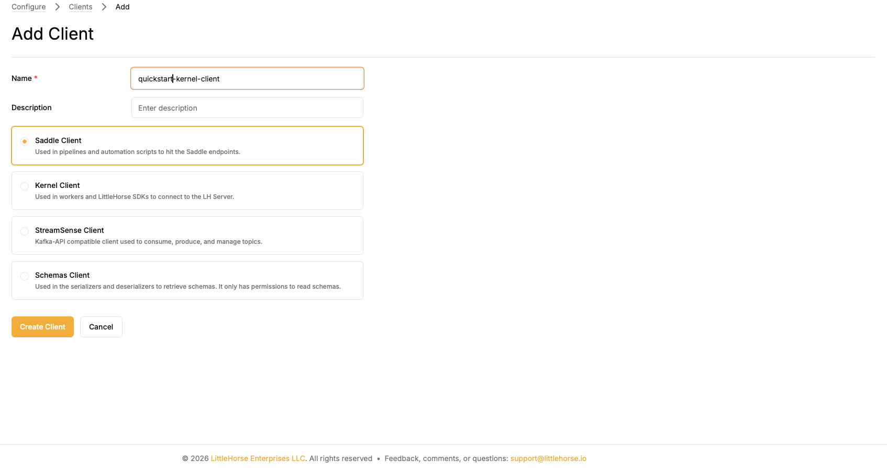
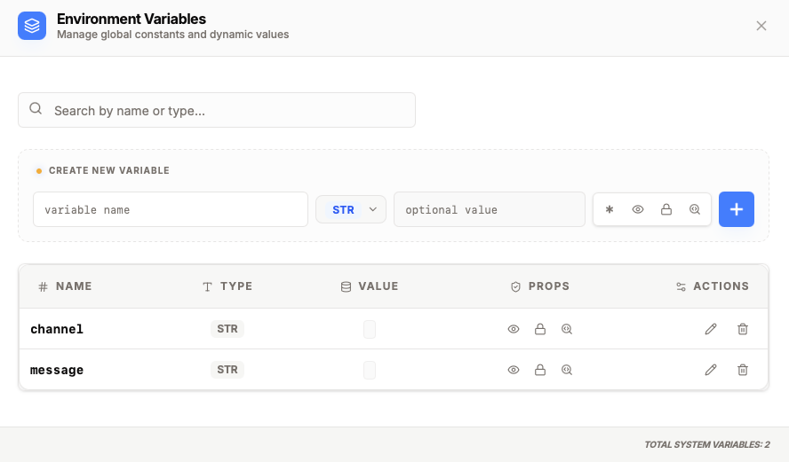
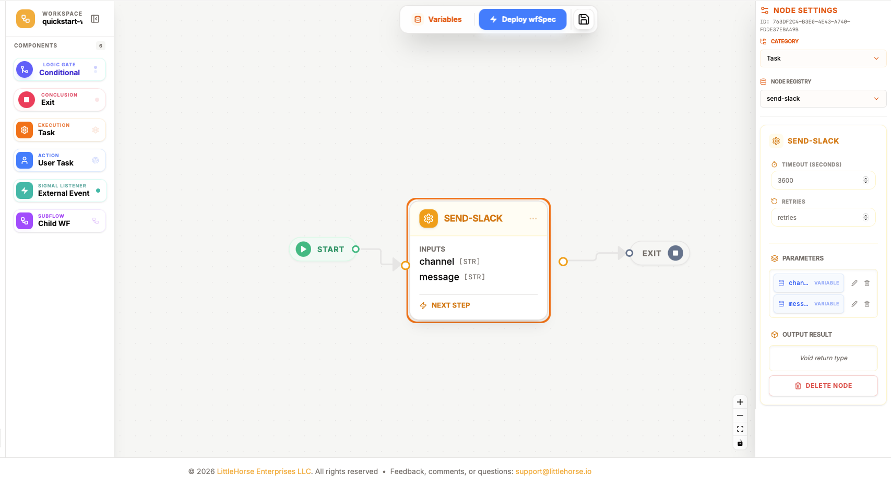
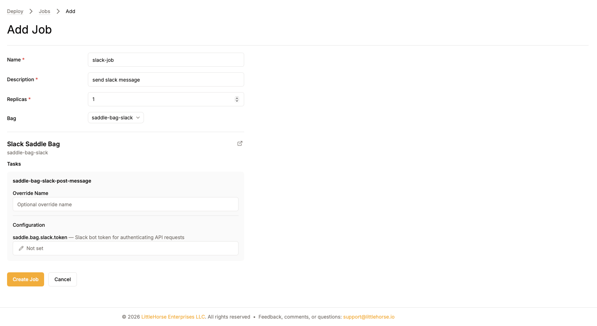
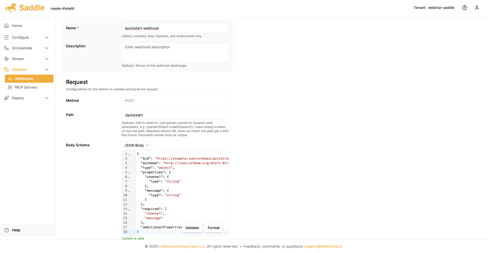
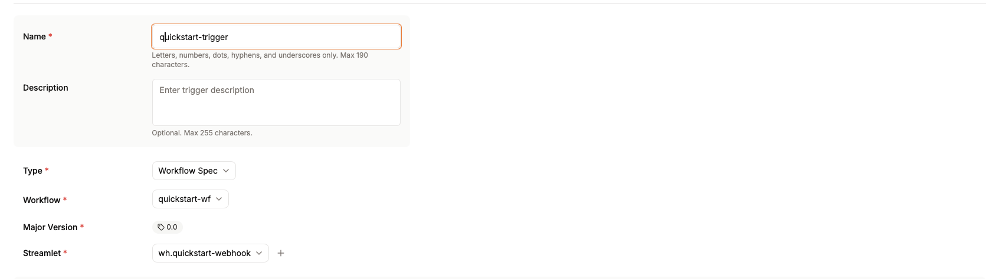
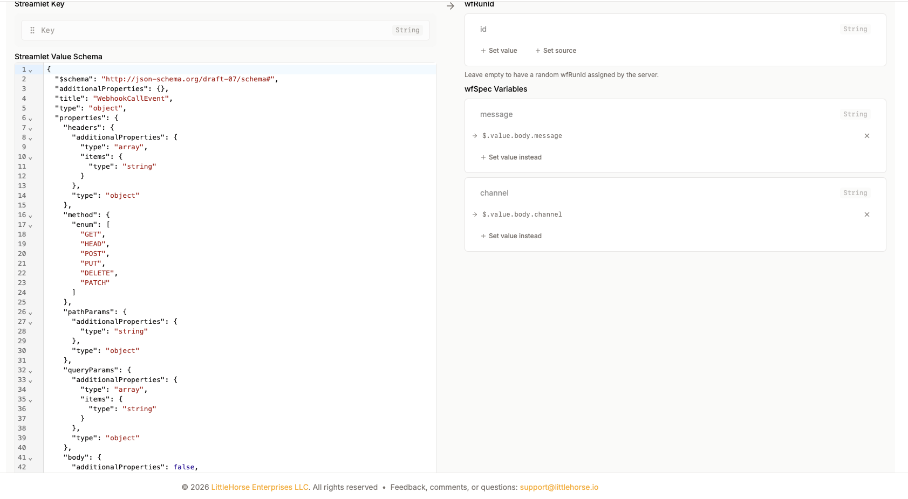

## Saddle Quickstart

In this quickstart, you will use the Saddle UI to build and deploy a WfSpec that handles a channel and message. You can send the message to Slack with a Saddle Bag or run a local Java task worker that prints it. You will then create a webhook and connect its streamlet to the workflow with a Workflow Trigger.

When finished, sending an HTTP request to the webhook will start the workflow and either deliver the message to Slack or print it in your terminal.

### Step 1: Configuring a Kernel Client

Begin by creating a Kernel Client. It provides the LittleHorse connection and OAuth configuration needed by applications that connect directly to the Kernel, including the local `send-slack-diy` worker.

In the left sidebar, expand **Configure** and select **Clients**. On the Clients page, click **Add Client** in the top-right corner.



Enter a name and an optional description, select **Kernel Client**, and click **Create Client**. Save the generated LittleHorse configuration so you can add it to the local `.env` file in Option 2.

### Step 2: Creating a WfSpec in Saddle

First, create a WfSpec that handles a channel and message.

In the left sidebar, expand **Orchestrate** and select **Workflows**. Click **Add Workflow** in the top-right corner, enter `quickstart-wf` as the workflow name, and create the workflow. Saddle will open the new WfSpec in the Workflow Builder.

Select **Variables** at the top of the Workflow Builder. Add two variables with the `STR` type: `channel` and `message`.



Choose one of the following task worker options.

#### Option 1: Send the message to Slack

Use this option if you have a Slack app and bot token. Drag a **Task** node from the left sidebar onto the canvas and select `send-slack` from the node registry. After deploying the WfSpec, complete the **Creating a Saddle Job** section to run the Slack worker.

#### Option 2: Print the message locally

Use this option if you do not have Slack. The included Java application registers a TaskDef named `send-slack-diy` and runs its worker from your machine.

Copy the environment template:

```bash
cp examples/saddle/00-quickstart/.env.example examples/saddle/00-quickstart/.env
```

Paste the complete LittleHorse configuration generated for the **Kernel Client** you created in Step 1 into `.env`, replacing every placeholder. Start the worker from the repository root and leave it running:

```bash
./gradlew :examples:saddle:java:00-quickstart:run
```

After the application registers the TaskDef, drag a **Task** node onto the Workflow Builder canvas and select `send-slack-diy` from the node registry. This worker prints the channel and message instead of contacting Slack.

For either option, set the task's `channel` parameter to the `channel` variable and its `message` parameter to the `message` variable.

Next, drag an **Exit** node onto the canvas to the right of the task. Connect the nodes in this order: **Start**, your selected task, **Exit**.



Click **Deploy WfSpec**, then click **Register Workflow**.

### Creating a Saddle Job

Skip this section if you selected Option 2 and are running the local `send-slack-diy` worker.

The `send-slack` task requires a running Saddle Job. A Saddle Bag is a prebuilt task worker, and a Saddle Job deploys that worker with the configuration it needs. For this workflow, use the `saddle-bag-slack` bag.

Open [Slack app management](https://docs.slack.dev/app-management/), create or configure an app for your workspace, and grant it the `chat:write` permission. Install the app in your workspace and copy its bot token.

Back in Saddle, expand **Deploy** in the left sidebar and select **Saddle Jobs**. Click **Add Saddle Job** in the top-right corner.

Enter a name and an optional description, then select `saddle-bag-slack` as the bag. Under **Configuration**, change the Slack token value from **Not set** to **Literal** and paste the bot token.



Click **Create Job** to start the worker.


### Creating a Webhook

The webhook receives a JSON request containing the Slack channel and message, then publishes the request to a streamlet.

In the left sidebar, expand **Connect** and select **Webhooks**. Click **Add Webhook** in the top-right corner.

Enter `quickstart-webhook` as the name and `/quickstart` as the path. Under **Body Schema**, select **JSON Body** and paste the following schema:

```json
{
  "$id": "https://example.com/schemas/quickstart-webhook.json",
  "$schema": "http://json-schema.org/draft-07/schema#",
  "type": "object",
  "properties": {
    "channel": {
      "type": "string"
    },
    "message": {
      "type": "string"
    }
  },
  "required": [
    "channel",
    "message"
  ],
  "additionalProperties": false
}
```



Validate the schema, then click **Create Webhook**. Saddle creates an associated streamlet named `wh.quickstart-webhook` for the incoming requests.

### Creating a Workflow Trigger

The Workflow Trigger starts the WfSpec whenever the webhook publishes a request to its streamlet.

In the left sidebar, expand **Stream** and select **Workflow Triggers**. Click **Add Trigger** in the top-right corner, then configure these fields:

- **Name:** `quickstart-trigger`
- **Type:** **Workflow Spec**
- **Workflow:** `quickstart-wf`
- **Major Version:** `0.0`
- **Streamlet:** `wh.quickstart-webhook`



Leave the `wfRunId` mapping empty so the server generates an ID for each run. Map the WfSpec variables to the webhook body:

- `message`: `$.value.body.message`
- `channel`: `$.value.body.channel`



Click **Create Trigger** to activate the integration.

### Testing the Workflow

Open the `quickstart-webhook` details page and copy its generated listener URL. Send a `POST` request with the Slack channel and message that the workflow expects:

```bash
curl --request POST '<WEBHOOK_LISTENER_URL>' \
  --header 'Content-Type: application/json' \
  --data '{
    "channel": "<CHANNEL>",
    "message": "Hello from Saddle!"
  }'
```

Replace `<WEBHOOK_LISTENER_URL>` with the complete URL shown by Saddle. For the Slack option, replace `<CHANNEL>` with the ID of a channel that the Slack app can access. For the DIY option, use any descriptive channel value.

The webhook publishes the request to `wh.quickstart-webhook`, and the Workflow Trigger starts a new `quickstart-wf` run. Confirm that the WfRun completes successfully in Saddle. The Slack option sends the message to the selected channel; the DIY option prints it in the terminal running the Java application.

