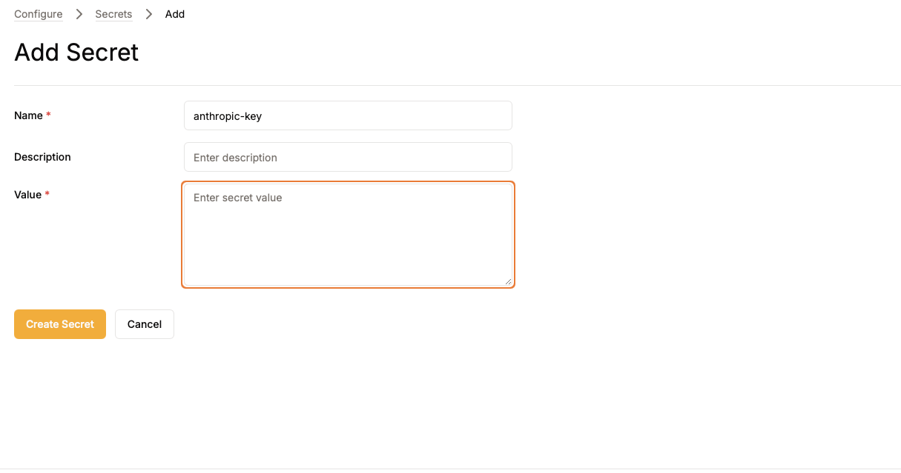
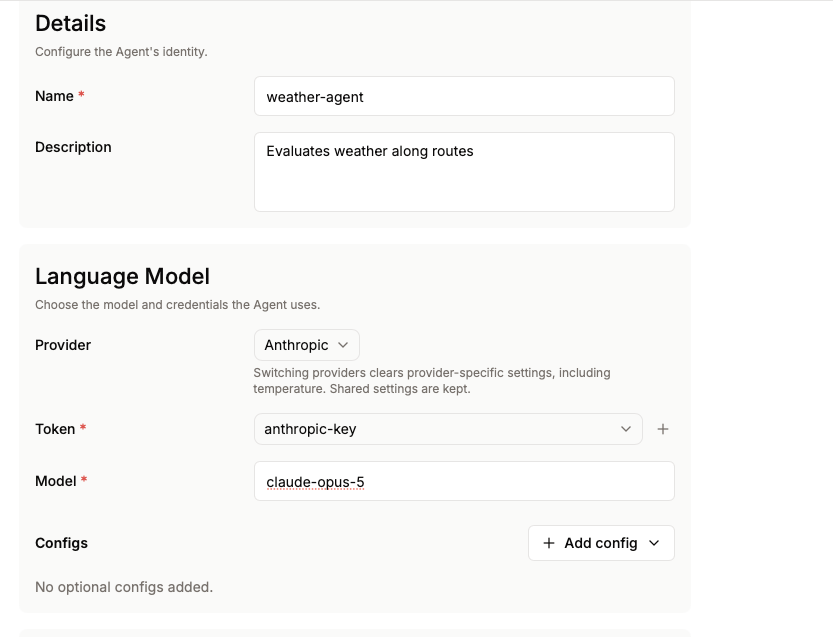
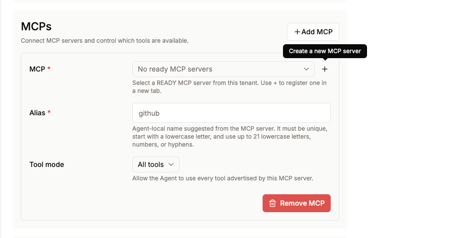
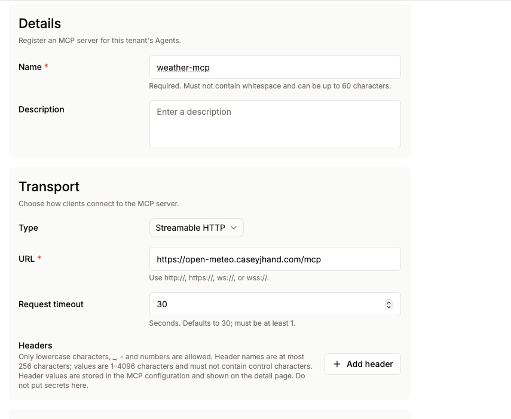
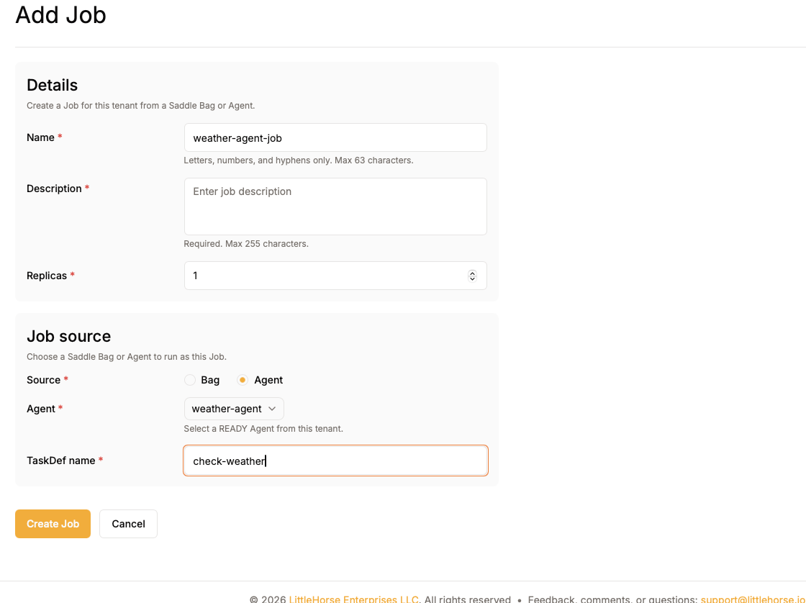
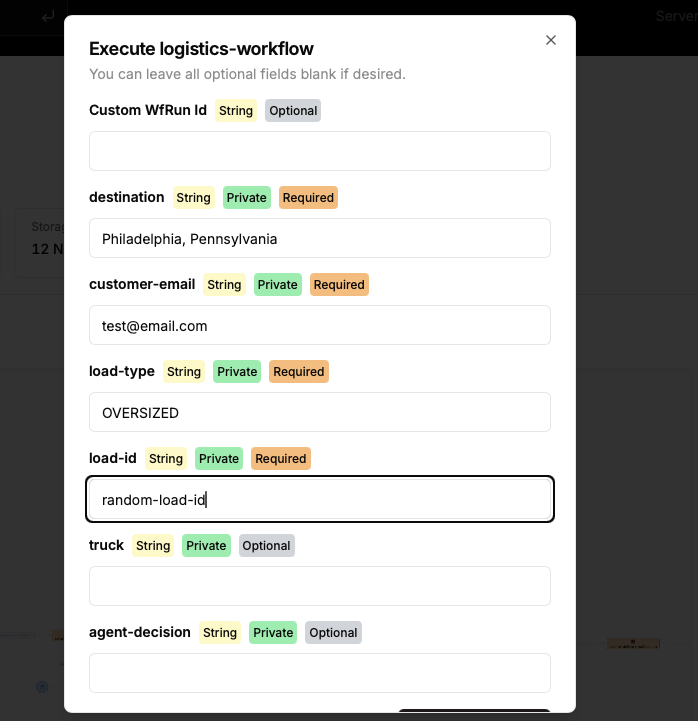

# Saddle Agent Quickstart

In this quickstart, you will build a logistics workflow that uses a Saddle Agent and a weather MCP server to decide whether a truck is safe to dispatch. You will configure an **Agent**, connect it to an **MCP server**, and deploy it with a **Saddle Job**.

The workflow accepts a destination, customer email, load type, and load ID. It assigns and loads a truck, waits for confirmation that loading is complete, checks the weather, and then either holds or dispatches the delivery.

## Step 1: Create the Model Provider Secret

Get an API key from either Anthropic or OpenAI, then open **Configure** -> **Secrets** in Saddle and click **Add Secret**:

* For Anthropic, name the secret `anthropic-key` and enter your Anthropic API key as its value.
* For OpenAI, name the secret `openai-key` and enter your OpenAI API key as its value.



## Step 2: Create the Weather Agent

Open **Deploy** -> **Agents**, then click **Add Agent** and name the agent `weather-agent`. Configure the language model using the provider you chose:

* For Anthropic, select **Anthropic**, choose the `anthropic-key` secret, and select a supported Anthropic model.
* For OpenAI, select **OpenAI**, choose the `openai-key` secret, and select a supported OpenAI model.

The screenshots below use Anthropic, but the remaining agent and workflow configuration is the same for OpenAI.



### Add the Weather MCP Server

In the **MCPs** section, click the plus button and open the MCP server setup in a new tab so you do not lose your progress configuring the agent.



Configure the server with the following values:

* **Name:** `weather-mcp`
* **Transport:** `Streamable HTTP`
* **URL:** `https://open-meteo.caseyjhand.com/mcp`
* **Authentication:** None



Click **Create MCP** and wait for the MCP server to become **READY**. Then close the MCP tab and return to the original tab where you were configuring the agent. In the agent's **MCPs** section, select `weather-mcp` from the MCP dropdown.

Add the following system prompt for your agent:

```text
You are a truck dispatch safety agent. Determine whether it is safe to dispatch a truck to the provided destination based on the current weather forecast.

Use the available tools to:
1. Find the coordinates of the destination.
2. Get the weather forecast for those coordinates.
3. Evaluate conditions such as precipitation, snow, wind speed, wind gusts, visibility, and temperature.

Return exactly "DISPATCH" or "HOLD". Do not include any other text.
```

Keep the input and output types set to `String`, leave the remaining settings at their defaults, and create the agent. Wait for its status to become **READY**.

## Step 3: Create the Saddle Job

Open **Deploy** -> **Saddle Jobs**, then click **Create New** in the top right. Configure the job to run the weather agent and register its task as `check-weather`.



Click **Create Job** and wait for the job status to become **READY** before continuing.

## Step 4: Configure the Kernel Client

Open **Configure** -> **Clients** and create or select a **Kernel Client**. Copy its LittleHorse credentials into a local `.env` file:

```bash
cp examples/saddle/01-agent-quickstart/.env.example \
	examples/saddle/01-agent-quickstart/.env
```

Replace every placeholder in `.env` with the corresponding Kernel Client value.

## Step 5: Run the Application

From the repository root, run:

```bash
./gradlew :examples:saddle:java:01-agent-quickstart:run
```

The application registers the mock `TaskDef`s and the `logistics-workflow` workflow with LittleHorse, then starts the task workers. Leave the application running while testing the workflow.

## Step 6: Execute the Workflow

Open **Orchestrate** -> **Workflows**, select `logistics-workflow`, and open it in the LittleHorse Dashboard. Click **Execute** and provide values for the required inputs. Leave the private `truck` and `agent-decision` variables empty.



The workflow assigns `mock-truck-001` and then waits for confirmation that the truck has been loaded. In another terminal, send the correlated event:

```bash
lhctl put correlatedEvent mock-truck-001 truck-loaded
```

The weather agent then checks conditions at the destination. A `HOLD` result sends a delay email and rechecks the weather after the configured delay. A `DISPATCH` result assigns a driver and sends the out-for-delivery notification.

Congratulations, you configured your first agent with Saddle. 